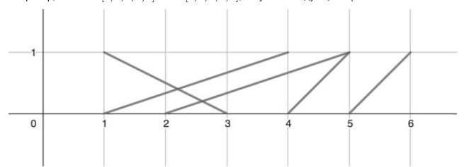

<h1 class="title">Яндекс (3 задание, Стажировка 2024, Контест)</h1>

<b>Время: 1 сек. Память: 256 Мб Сложность: Medium</b>

С. Пересекающиеся отрезки

Даны два массива а и b длины N из целых чисел. Рассмотрим множество, состоящее из отрезков, соединяющих точки (0, аi) и (1, bi) для 1 ≤ i ≤ N. Найдите количество отрезков этого множества, которые не пересекаются с другими отрезками.

Например, если а = [1, 2, 3, 4, 5] и b = [4, 5, 1, 5, 6], получатся следующие отрезки:

Обратите внимание, что пересекающимися считаются отрезки, имеющие хотя бы одну общую точку. То есть отрезки, имеющие одинаковый конец, пересекаются. Например, на картинке отрезки, заданные точками [(0, 2), (1, 5)] и [(0,4), (1, 5)] считаются пересекающимися.

<h2>Формат ввода</h2>

В первой строке ввода находится единственное число N (1 ≤ N ≤ 3 * 105) - количество отрезков.

В следующих N строках находится по два целых числа, разделенных пробелом - ai и bi (1 ≤ ai, bi ≤ 2 * N), задающие координаты і-го отрезка.

Гарантируется, что все отрезки, заданные во вводе различны, то есть при і &ne; ј выполнено не менее одного из условий аi &ne; aj и bi &ne; bj.

<h2>Формат вывода</h2>

Выведите единственное число - количество отрезков, которые не пересекаются с другими.

<h2>Примечания</h2>

В первом примере единственный отрезок, не пересекающийся с другими - отрезок с концами (0, 5) и (1,6).

<h3>Примеры</h3>
<table class="sample-tests">
  <thead>
     <tr>
        <th>Ввод</th>
        <th>Вывод</th>
     </tr>
  </thead>
  <tbody>
     <tr>
        <td>5
         1 4
         2 5
         3 1
         4 5
         5 6       
        </td>
        <td>1</td>
     </tr>
     <tr>
        <td>5
         2 6
         3 9
         4 2
         6 9
         9 10      
        </td>
        <td>1</td>
     </tr>

  </tbody>
</table>