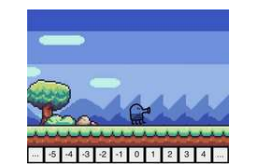
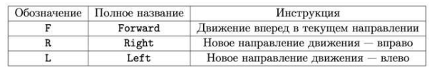
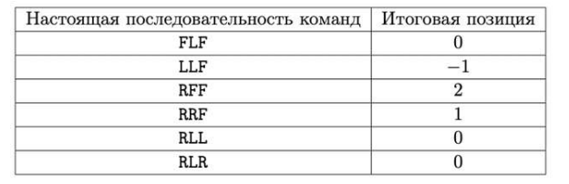

<h1 class="title">Яндекс (4 задание, Стажировка 2024, Контест)</h1>

<b>Время: 1 сек. Память: 256 Мб Сложность: Medium</b>

D. Игра-платформер

Вы разрабатываете игру-платформер. Игровое поле может быть представлено как бесконечная клетчатая полоска, каждая клетка которой занумерована целым числом как на картинке ниже. Изначально игрок находится в позиции 0 и смотрит вправо.

На вход вашей программе подается последовательность команд - движения игрока. Они могут быть трех типов:

При этом разрешается несколько раз выполнять один и тот же поворот, например, «LL». После такой последовательности команд игрок будет смотреть влево.

Вы нашли уязвимость в игре и получили последовательность действий вашего друга. Вам известно, что перехваченная вами последовательность отличается от настоящей ровно в одном символе. Найдите все позиции, в которых мог на самом деле оказаться ваш друг после выполнения всех действий.

<h2>Формат ввода</h2>

В первой строке ввода находится единственное целое число N (1 ≤ N ≤ 3 * 105) - количество команд.

Во второй строке находятся N символов - сами команды. Гарантируется, что все символы принадлежат множеству {«F»,«R»,«L»}.

<h2>Формат вывода</h2>

Выведите единственное число - количество различных позиций, на которых мог оказаться игрок после выполнения всех действий.

<h2>Примечания</h2>

Обратите внимание, что исходная последовательность не может быть настоящей последовательностью действий.

В первом примере возможны следующие последовательности команд:

Всего есть 4 различных позиции, в которых мог оказаться игрок (0, 1, -1 и 2).

<h3>Примеры</h3>
<table class="sample-tests">
  <thead>
     <tr>
        <th>Ввод</th>
        <th>Вывод</th>
     </tr>
  </thead>
  <tbody>
     <tr>
        <td>3
         RLF
        </td>
        <td>4</td>
     </tr>
      <tr>
        <td>6
         LRFFLR
        </td>
        <td>6</td>
     </tr>
     <tr>
        <td>3
         FFF
        </td>
        <td>3</td>
     </tr>

  </tbody>
</table>