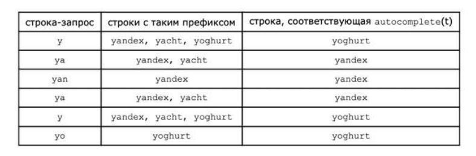

<h1 class="title">Яндекс (5 задание, Стажировка 2024, Контест)</h1>

<b>Время: 1 сек. Память: 512 Мб Сложность: Medium</b>

Е. Автодополнение

Дан словарь из N различных слов, каждому из которых сопоставлено целое число - его популярность. Чем популярность слова больше, тем чаще оно используется пользователями.

Для строки s определим autocomplete(s) как индекс (в исходной нумерации) строки с наибольшей популярностью среди строк, для которых s является префиксом (если строка s пустая, то она является префиксом всех слов словаря). Если строки с префиксом s не существует, то положим значение функции равным - 1.

Есть изначально пустая строка t. Вам необходимо обработать Q запросов двух типов:
 · «+ с» - добавление символа c в конец строки t
 · «-» - удаление последнего символа строки t. Гарантируется, что строка на момент получения запроса не пустая
 После каждого запроса выведите значение autocomplete(t).

<h2>Формат ввода</h2>

В первой строке ввода находятся числа N и Q (1 ≤ N, Q ≤ 105) - размер словаря и число запросов. В і-й из следующих N строк находится строка wi (1 ≤ |wi| ≤ 106) и целое число pi (0 ≤ pi ≤ 109), разделенные пробелом - і-е слово словаря и его популярность, соответственно.

Гарантируется, что суммарная длина слов не превосходит 106. Следующие Q строк содержат запросы. Каждый запрос находится в отдельной строке и соответствует формату, описанному в условии задачи, а именно:
 · если і-й запрос является запросом добавления символа, і-я строка содержит символ «+» и единственную строчную букву с,
разделенные пробелом.
 · иначе і-й запрос является запросом удаления символа, а і-я строка содержит единственный символ «-»
 Гарантируется, что запросы корректны, то есть удалений символа из пустой строки не происходит.

<h2>Формат вывода</h2>

Выведите значение функции autocomplete после каждого изменения строки.

<h2>Примечания</h2>

<h3>Примеры</h3>
<table class="sample-tests">
  <thead>
     <tr>
        <th>Ввод</th>
        <th>Вывод</th>
     </tr>
  </thead>
  <tbody>
     <tr>
        <td>3 6
         yandex 10
         yacht 1
         yoghurt 15
         + y
         + a
         + n
         -
         -
         + o
        </td>
        <td>3
         1
         1
         1
         3
         3
        </td>
     </tr>

  </tbody>
</table>